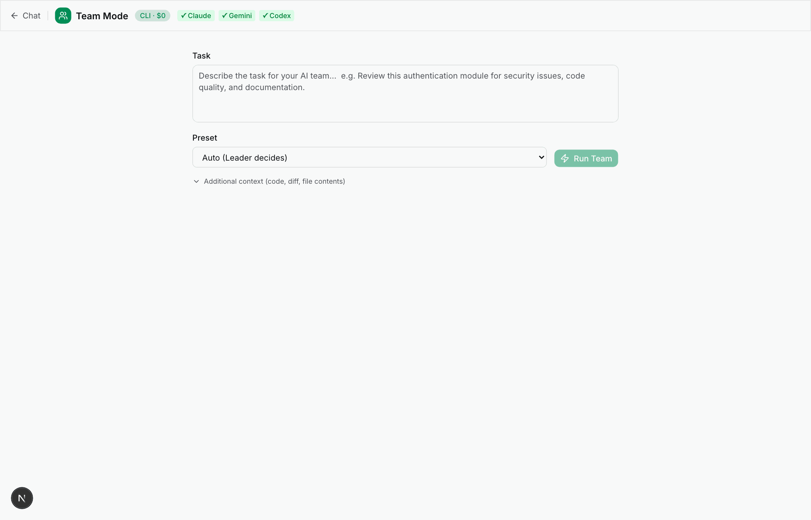
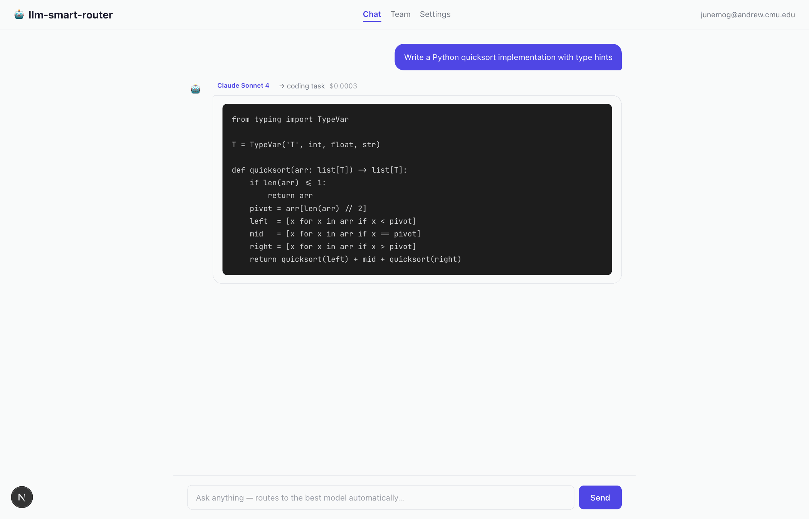

<!-- _class: title -->

# `llm-smart-router`

### Multi-model AI agent orchestrator

June Gu · CMU 06-642 · Spring 2026

`github.com/junegu-glitch/llm-smart-router`

---

## The Problem

Most AI workflows treat every task as input to one chat window.

But models have real specializations:

| Task | Best fit | Why |
|------|----------|-----|
| Code generation | Claude Sonnet | Benchmark leader |
| Long documents | Gemini 2.5 Pro | 1M token context |
| Math / reasoning | DeepSeek R1 | 54× cheaper than Claude |
| General / cheap | DeepSeek V3 | $0.028 / 1M tokens |

**Switching manually is friction. Choosing wrong is waste.**

---

## The Solution

```bash
# Automatically routes to the right model
smart-router "Implement a binary search tree in Python"
→ Route: [coding] → Claude Sonnet 4

# Multi-model team for larger tasks
smart-router team run --preset code-review --git-diff "Review my changes"
→ SecurityReviewer + QualityReviewer + DocReviewer → Synthesis

# Zero cost with subscription CLIs
smart-router team run --use-cli "Compare React vs Vue"
→ Cost: $0.00
```

One command surface. Best model for each task. $0 with existing subscriptions.

---

## Architecture

```
┌─────────────────────────────────────────────┐
│               User Input                     │
├─────────────────────────────────────────────┤
│   Router  (7-category classifier)            │
│   "write code" → coding → Claude Sonnet     │
├─────────────────────────────────────────────┤
│         Team Orchestrator                    │
│  ┌────────┐  ┌────────┐  ┌────────┐        │
│  │ Claude │  │ GPT-4o │  │ Gemini │ ← parallel
│  │[coding]│  │[writing│  │[research]        │
│  └────────┘  └────────┘  └────────┘        │
├─────────────────────────────────────────────┤
│   Leader synthesizes → Final Report          │
└─────────────────────────────────────────────┘
```

CLI layer (`src/cli/`) + Optional web UI (`src/app/`)

---

## Key Innovation: $0 Team Mode

Most teams cost money per token. This one doesn't have to.

**`--use-cli` flag** — routes each teammate through locally installed subscription CLIs:

```
Claude teammate  → claude  CLI  (Anthropic subscription)
Gemini teammate  → gemini  CLI  (Google subscription)
Codex teammate   → codex   CLI  (OpenAI subscription)
```

If you already pay for these subscriptions, **team runs cost $0 in API tokens.**

```bash
smart-router team run --use-cli \
  "Compare Python vs Rust for a web scraper"

Total cost: $0.00   (3 models, 91 seconds)
```

---

## Demo — CLI in Action


---

## Demo — Team Mode



---

## Web UI — Same Tool, Browser Interface

Live at: `https://scientific-software-engineering-wit.vercel.app`

| Feature | Stack |
|---------|-------|
| Smart-routed chat | Same routing logic as CLI |
| **Team Mode** (`/team`) | SSE streaming, live dashboard, preset selector |
| **Live team dashboard** | Per-teammate timer, progress bar, expand all |
| GitHub OAuth login | Supabase Auth |
| API key management | AES-256-GCM encrypted, cloud-synced |
| Dark / light mode | Tailwind + system preference |

CLI and web share the same `src/lib/` core — routing, model catalog, provider calls.
Team mode works both in `smart-router serve` ($0 with CLIs) **and** with BYOK API keys.

---

## Web UI — Live Demo



---

## Evidence: Tests & CI

**167 automated tests** across 14 test files:

```
npm test  →  167 passed (167)  in 2.31s
```

| Covered | Tests |
|---------|-------|
| Router (classification + model selection) | 22 |
| Team orchestration (plan → parallel → synthesize) | 28 |
| CLI hybrid mode (detection + subprocess) | 21 |
| Session save / load / list | 18 |
| Provider fallback chains | 19 |
| `callLLM` CLI hybrid branch (new) | 6 |
| Team run $0 cost rollup (new) | 5 |

**GitHub Actions CI** — Node 20 + 22 matrix, runs on every push.

[](https://github.com/junegu-glitch/llm-smart-router/actions/workflows/ci.yml)

---

## Project Evolution

```
Project 1 (plateprep)
  └── Python CLI, narrow scope, one lab task
      No external APIs

Project 2 (llm-smart-router — CLI)
  └── TypeScript CLI, smart routing, team mode
      154 tests, provider integrations

Final Project (current)
  └── + GitHub Actions CI (Node 20 + 22)
      + --use-cli subscription hybrid ($0 cost)
      + Next.js web UI + Supabase auth + Vercel
      + Karpathy-style wiki (persistent context across sessions)
      + Public GitHub repo
```

Each step: same tool, deeper understanding of what "polished" means.

---

## What I Learned About Agentic Engineering

**Beginning of semester**: AI writes draft → I fix it

**By Project 2**: Specify failure cases before implementation, not after

**For final project**:
- Plan mode before any significant change
- Wiki system for context across sessions (`/ingest`, `/query`, `/lint`)
- Stating invariants explicitly beats correcting output

**The meta-moment**: Used Claude Code to build a tool that runs Claude, Gemini,
and Codex as parallel subprocesses.

> The orchestrator was built by an agent.
> The agents it orchestrates include the agent that built it.

---

## Limitations & Future Work

- **Provider setup friction** — BYOK requires manual `config set` per provider; a guided `smart-router auth` wizard would lower the barrier
- **Routing edge cases** — mixed-type prompts (math + code) aren't classified well; ensemble classifier could improve precision
- **Cross-model verification** — the README describes Claude → Gemini → Codex → Claude judge pipeline, but it's not yet implemented as a preset
- **Web UI** — functional (OAuth, cloud sync, chat) but not polished enough for independent users

---

<!-- _class: title -->

## Thank you

**`llm-smart-router`** — route work to the best model, run parallel agent teams, $0 with subscription CLIs

`github.com/junegu-glitch/llm-smart-router`

```bash
npm install -g llm-smart-router
smart-router team run --use-cli "your complex task here"
```

---

*Questions?*
